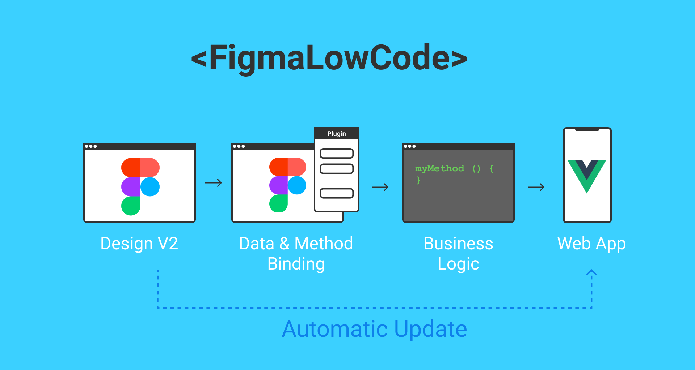
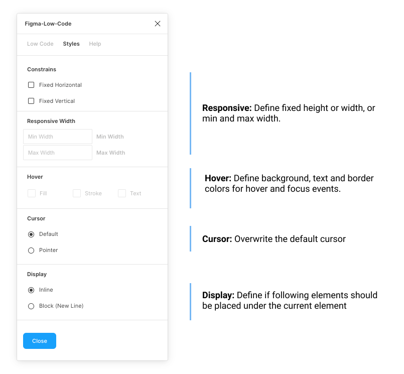
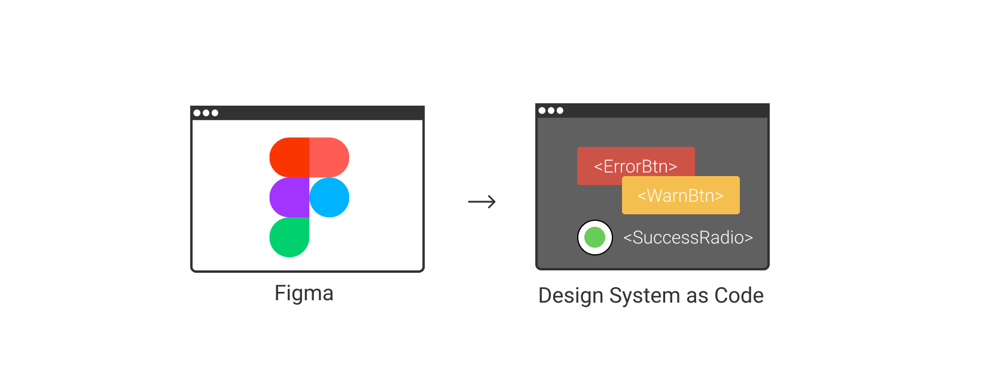
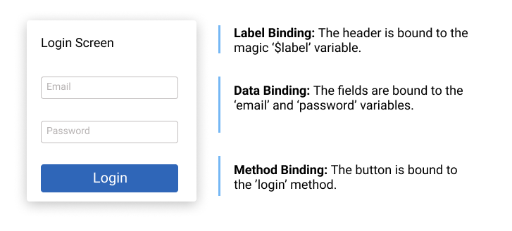
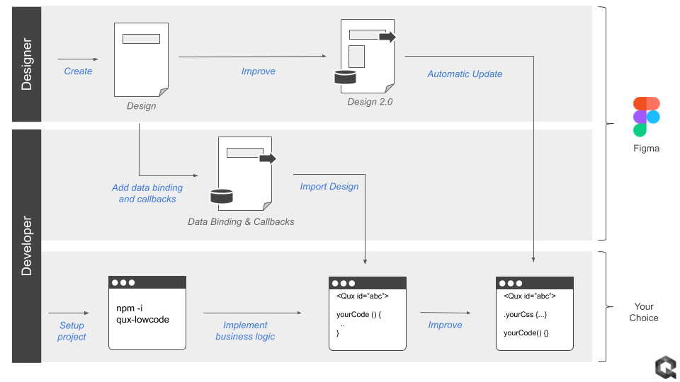

# Figma-Low-Code

Figma-Low-Code is an OpenSource project, that allows to use **Figma** designs directly in **VUE.js** applications. The low code approach reduces drastically the hand-off time between designers and developers, reduces front-end code and ensures that the Figma design stays the **single source of truth**.


[](https://www.youtube.com/watch?v=iyu2rSbUwU8)


I have created to short tutorials in YouTube:

[Video - Quick Tutorial](https://www.youtube.com/watch?v=iyu2rSbUwU8)

[Video - Step by step guide](https://youtu.be/n8YvL_YvXRA)


Example project scan be found here:

[Figma Low Code ToDo Example](https://github.com/KlausSchaefers/figma-low-code-todo)

[Figma File](https://www.figma.com/community/file/887084011990415230)

[Figma-Low-Code Design System Example](https://github.com/KlausSchaefers/figma-design-system-example)

## Idea
The core idea of the project is to render the visual design automatically and allow the development team to focus on business logic, without restricting the developers' freedom. Figma-Low-Code enables:

1. Zero Code rendering of app designs, prototypes and design systems.
2. Design changes do not require code changes
3. Clear separation of UI and business logic
4. Developers can focus on code
5. Developers can use the tools and frameworks of their choice.
6. Designers stick with their favorite tool
7. Easy extension with custom callback functions
8. Full support of VUE data binding.
9. Extension with custom components
10. Extension with custom CSS
11. Rich library of stylable components.

## Two ways of using Figma-Low-Code

Figma-Low-Code provides two modes of operation.
1. The first mode is the 'Full' low code mode. The Figma design is entirely rendered and wired to the
business logic. The front-end developers will usually do little UI customization and focus on backend connectivity and business logic.
2. The second mode is the so called 'Design System' mode, which turns a design system into Vue components. The developers can simply use these as any other VUE component within their projects.


The full mode will result in a faster development experience, however developers have less control over the front end. The 'Design System' mode gives more control for the developers, while still easing the transition from design to code. Please note, that both approaches will maintain the design as the **single source of truth**. Design channges will be immediately visible in the application.


## Plugin:

To use the advanced features such as data, method binding or input widgets, you must install the  [Figma-Low-Code plugin](https://www.figma.com/community/plugin/858477504263032980/Figma-Low-Code). The plugin has two main tab. The 'Low Code' tab allows you to set the basics, such as the element type, or the input and output data binding.


The 'Style' tab allows you to define, if the element should be fixed width or height. By default Figma Low Code will assume hat the widget is responsive. Also, you can define hover styles for the fill, stroke and text color. For input elements focus styles can also be defined.




You can find the plugin [here](https://www.figma.com/community/plugin/858477504263032980/Figma-Low-Code)


# Development Guide

Table of contents

1. [Installation](#How-to-install-Figma-Low-Code)
2. [Full Mode](#Full-Mode)
3. [Design System Mode](#Design-System-Mode)
4. [Deployment](#Deployment)
5. [Responsive Rendering](#Responsive-Rendering)
6. [Low Code Workflow](#Low-Code-Workflow)
7. [Contact & Support](#Contact-and-Support)


## How to install Figma-Low-Code

The easiest way to use Figma-Low-Code is to clone this repository and install Node.js version 12 or higher.

```
git clone https://github.com/KlausSchaefers/figma-low-code.git
```

Navigate to the cloned repository

```
cd figma-low-code
```

Afterwards, load all dependecies with the following command

``` sh
npm install
```

Finally start the server

``` sh
npm run serve
```


## Full Mode
In the full mode the <Figma> component is used to render the entire front end. The first step is top register these components in Vue. The following section will use Quant-UX design as an example.  Open the 'src/views/Home.vue' and enter your figma file id and the access code. You can get the access code in your Figma settings [(Details)](https://www.figma.com/developers/api#access-tokens).
The file id is the second last url parameter

```
https://www.figma.com/file/<FigmaFileId>/...
```

Once you have entered the values, the Home.vue should look like:

``` vue
<template>
  <div class="home">
    <Figma :figma="figmaConfig" v-model="viewModel"/>
  </div>
</template>

<script>
import Vue from "vue";
import Figma from 'vue-low-code'
Vue.use(Figma);

export default {
  name: 'Home',
  data: function () {
    return {
      figmaConfig: {
        figmaFile: '<The figme file id here>',
        figmaAccessKey: '<Your Figma access key ONLY for development>',
      },
      viewModel: {
      }
    }
  },
  components: {
  },
  methods: {
  }
}
</script>

```


**Attention** For large design the Figma API might give an error or be slow. It can help to limit the <Figma> component to a certain page.
``` vue
<template>
  <div class="home">
    <Figma :figma="figmaConfig" v-model="viewModel" page="Page 1"/>
  </div>
</template>

```


### Input Elements

By default Figma-Low-Code renders all elements of the design as div, span and label elements. Often this is not enough, and you
would like to allow the user to enter to. You can override the default rendering by specifying the desired element type, for instance text fields or password fields. To do so, you need to launch the Figma-Low-Code plugin and select an element. Once an element is selected, you can select from a list of widgets the desired element type.


### Data Binding

Figma-Low-Code supports VUE data binding. You have to pass a v-model to the **Figma** component.

``` vue
<Figma :figma="figmaFile" v-model="viewModel"/>
```

You can specify the databinding with the help of the Figma-Low-Code plugin:

1. Launch the plugin
2. Select the desired element.
3. Select the 'Low Code Tab'
4. Specify the name of the varibale, for instance 'user.name'.


During runtime, the low-code component will update the viewModel and add the values entered by the user, e.g.

``` js
    viewModel: {
        user: {
          name: "Klaus"
        }
    }
```

### Method Binding

In the Figma-Low-Code plugin you can define javascript callbacks for the elements. You can specify the databinding with the help of the Figma-Low-Code plugin:

1. Launch the plugin
2. Select the desired element.
3. Select the 'Low Code Tab'.
4. Enter the name of the method taht should be called on the event (click or change are supported for now)


During run time, the figma component will look for a method with the given name in the parent component (in the example  Home.vue). If the method exists, it will be called. The method will have the following signature:

``` js
myMethod (value, element, e) {
 ...
 return 'Screen2'
}
```

If a method return a String matching a screen name, the page will be loaded. In the example the screen with the name 'Screen2'.

### Responsive Rendering

You can configure Figma-Low-Code to use different Figma pages for different screen resolutions. You can for instance define
that the page 'A' is used of mobiles and 'B' is used for desktop and tablets. You can pass the
mapping between pages and devices as part of the config object.

Check out this [example](https://youtu.be/VIJiMAXUB-g?t=32)

```vue
<template>
  <div class="home">
    <Figma :figma="figmaConfig" v-model="viewModel" :config="config"/>
  </div>
</template>

<script>
import Vue from "vue";
import Figma from "vue-low-code";
Vue.use(Figma);

export default {
  name: "Home",
  data: function () {
    return {
      figmaConfig: {
        figmaFile: "",
        figmaAccessKey: "",
      },
      viewModel: {
        /**
         * Add your view model here
         */
      },
      config: {
        /**
         * Configure the reponsive behavior here. The 'page'
         * property is the name of the Figma page.
         **/
        responsive: [
          { page: "A", types: ["desktop"] },
          { page: "B", types: ["tablet", "mobile"] },
        ],
        components: {
          /**
           * Register costum components here
           */
        },
      },
    };
  },
  components: {},
  methods: {
    /**
     * Place your methods here
     */
  },
};
</script>

```

### Custom components

If the provided input elements are not enough, you can also hook in your own VUE components. To do so:

1. Launch the plugin
2. Select the desired element.
3. Select the 'Element Type' tab
4. Select Custom
5. Enter the name of the component


Furthermore you will need to register the component with the **Figma** component.

``` vue
<template>
  <div class="home">
    <Figma :figma="figmaConfig" v-model="viewModel" :config="config"/>
  </div>
</template>

<script>
import Vue from "vue";
import Figma from 'vue-low-code'
import MyComponent from './MyComponent.vue';
Vue.use(Figma);

export default {
  name: 'Home',
  data: function () {
    return {
      figmaConfig: {
        figmaFile: '<The figme file id here>',
        figmaAccessKey: '<Your Figma access key ONLY for development>',
      },
      viewModel: {
      },
      config: {
        components: {
          'MyComponent': MyComponent
        }
      }
    }
  },
  components: {
  },
  methods: {
  }
}
</script>

```


### Hover and Focus effects

Often you want certain elements to have a hover effect. For instance, a button should
change the background color if the mouse is hovering it. Also, it is useful to indicate if an input is focused by the user.
To create these kind of effects, perform the following steps:

1. Launch the plugin
2. Select the desired element.
3. Select the 'Style' tab
4. Select a fill (stroke or text) color.

Please note that the colors must be defined upfront in the Figma file, for instance as a style.

### Custom components and rendering

Sometimes you want to render a certain part of the UI by your self, or replace existing widgets with custom implementations.
You can do this by passing a **components** array to the configuration. These components will be used at the specified screen
location instead of the default Figma component. This approach allows you to fully manage certain parts of the UI. Data is passed
as a **value** property and follows default VUE practices.

``` vue
<Figma :app="app" :config="config"/>
...

<script>
import MyWidget from 'src/myWidget'

...

config = {
  components: [
    {
      cssSelector: ".ArtBoard .ElementName",
      type: "MyWidget",
      component: MyWidget
    }
  ]
}
</script>
```

You specify the widget to be replaced by the custom widget by a css selector. For instance if you want to replace the
widget with the name "Custom" on the "StartScreen" artboard, use the ".StartScreen .Custom" selector.


## Design System Mode





The Design System mode allows to turn your design system into Vue components that can be used as normal components. The first step is to *globally* register the design system before any template is parsed. The easiest way is to register the design system in the `main.js`file:

```javascript
import Vue from 'vue'
import App from './App.vue'
import './registerServiceWorker'
import router from './router'
import * as VueLowCode from 'vue-low-code'
import figmaDesign from './views/figma-design-system.json'

Vue.config.productionTip = false

/*
 * Make sure the design is registered before the App is mounted
 */
async function init () {
  // for live debuging use Figma.createQUXDesignSystem(<quxSharekey>)
  await VueLowCode.createQUXDesignSystem(quxDesign)

  new Vue({
    router,
    render: h => h(App)
  }).$mount('#app')
}

init()

```

The Vue-Low-Code package provides a method for Figma (`createFigmaDesignSystem`). For Figma design systems, you use your [API token](https://www.figma.com/developers/api#access-tokens) and fileID, or you can download the Figma design using the *download.js* script

```bash
node download.js <api token> <fileID>
```

You can also pass the name of a page, to limit the import. Just passs the page name as the third parameter.

```bash
node download.js <api token> <fileID> <page name>
```


### Using the Figma-Low-Code Design System

Once the design system is registered, they can be used within any template in the application. Suppose there is primary button defined in the design system. This can be invoked be simple using a tag with the corresponding name. Please make sure that the design system names do not clash with standard HTML elements, or other
components in your code base.

```vue
<PrimaryButton/>
```

For simple elements like boxes, rectangles or labels one can use the wrapped notion to replace the inner elements. An alternative is to use the label property

```vue
<PrimaryButton>Hello World</PrimaryButton>
<PrimaryButton label="Hello World"/>
```

For input elements, also the v-model element works. In addtion a placeholder and options element is supported

```vue
<PrimaryField v-model="user.name" placeholder="Enter a name"/>
<PrimaryDropDown v-model="user.job" :options="job" />
...
jobs = [
  {label: 'Developer', value:'deverloper'},
  {label: 'Designer', value:'designer'},
]

```

### Data and Method Binding

Low Code Design Systems are not limited to simple components like buttons or text, but can also be compplex components like forms, dialogs and so on. Usually one has to use data and method binding ([Details](##define-data-binding-and-callbacks)) in this situations to populate the elements with data. The relevant (child) elements have to be wired to the right data and the right actions have to be defined. For instance in a login dialog, the email field needs to be wired to the `email` variable and the password field to the `password` variable. The button needs to get a method binding for the `login` method. When the
user clicks in the button, and 'login' event will be fired, which can be used using the standard '@' notation. Please note, that when a component consist out of more than one shapes, it is not possible infer where the label text should be shown. One has to specify a magic data binding (`$label`). The wiring of the login dialog would look like



The code would be

```vue
<LoginDialog v-model="loginData" label="Enter your credentials" @login="myLoginMethod">

...
loginData = {
  email: '',
  password: ''
}

....

myLoginMethod () {
  // your code
}
```

# Deployment

Working with the file and access key is great for testing and development, because changes in Figma are visible after a reload.
However, for production you should **NEVER** use the access token, as it gives access
to all your projects. You can download all files into the project by calling the download script.

``` sh
node download.js <access_token> <figma_file_id>
```

The script will download the figma file and all images. You have to point the Figma Component now to the file, instead of the config object. Use an import statement to simply load the JSON.

``` vue
...
<Figma :figma="figmaFile" v-model="viewModel"/>
...

<script>
import FigmaFile from './app.json'

export default {
  name: 'Home',
  data: function () {
    return {
      figmaFile: FigmaFile
      ...
    }
  },
...
</script>

```

# Configure figma-low-code

You can configure certain parameters, e.g. the routing rules. To do so, pass a config object to the
**Figma** component.

``` vue
<Figma :figma="figmaFile":config="config"/>
```

The config object can have the following properties and hsould be defined in the data section of the home component.

``` js
    config: {
        loadFonts: false,
        css: {
          grid: true, // Use CSS grid to align objects. False will use CSS-Flex.
          justifyContentInWrapper: true // In justifz or left align content in wrapped elements
        },
        router: {
          key: 'id', // alternative routing parameter
          prefix: 'figma' // path prefix that will be used when rendering links
        }
    }
```

Youmight also want to import the fonts in you index.html. Figma-Low-Code will load them by default dynamically. If you want to prevent this,
set the 'loadFonts' property to false


# Workflow

Figma-Low-Code enables the following workflow to facilitate painless collaboration between designers and developers:



1. The designer creates an initial design in Figma
2. The developer adds data binding and method callbacks in Figma using the UX Figma-Low-Code plugin.
3. The developer sets up a new project (Vue.js for now) and includes the **Figma** component
4. The developer links to the Figma design and creates the required methods and fills them with business logic.
5. The **Figma** component renders the design and invokes the callbacks in clicks.
6. Changes in the design are transparent to the developer, he just reloads the design from Figma.
7. For deployment the developer downlaods the figma file to freeze the design


# The handoff problem
Designers and developers use different tools to build user interfaces. Once a designer
has completed the interface design, he hands-off the design to the developer, usually
in the form of an image and some specs. The developer has now to rebuild the
entire design using the programming language of his choice. Although this process is
proven, it is rather slow and not very efficient. In particular later changes in
the design makes it hard to automize this work through code generation tools.


# Contact-and-Support

If you want to reach out please use the [Contact](https://quant-ux.com/#/contact.html) page or [Spectrum Chat](https://spectrum.chat/quant-ux)

# Credits

Figma-Low-Code is based on vue-low-code developed by [Quant-UX](https://quant-ux.com).
